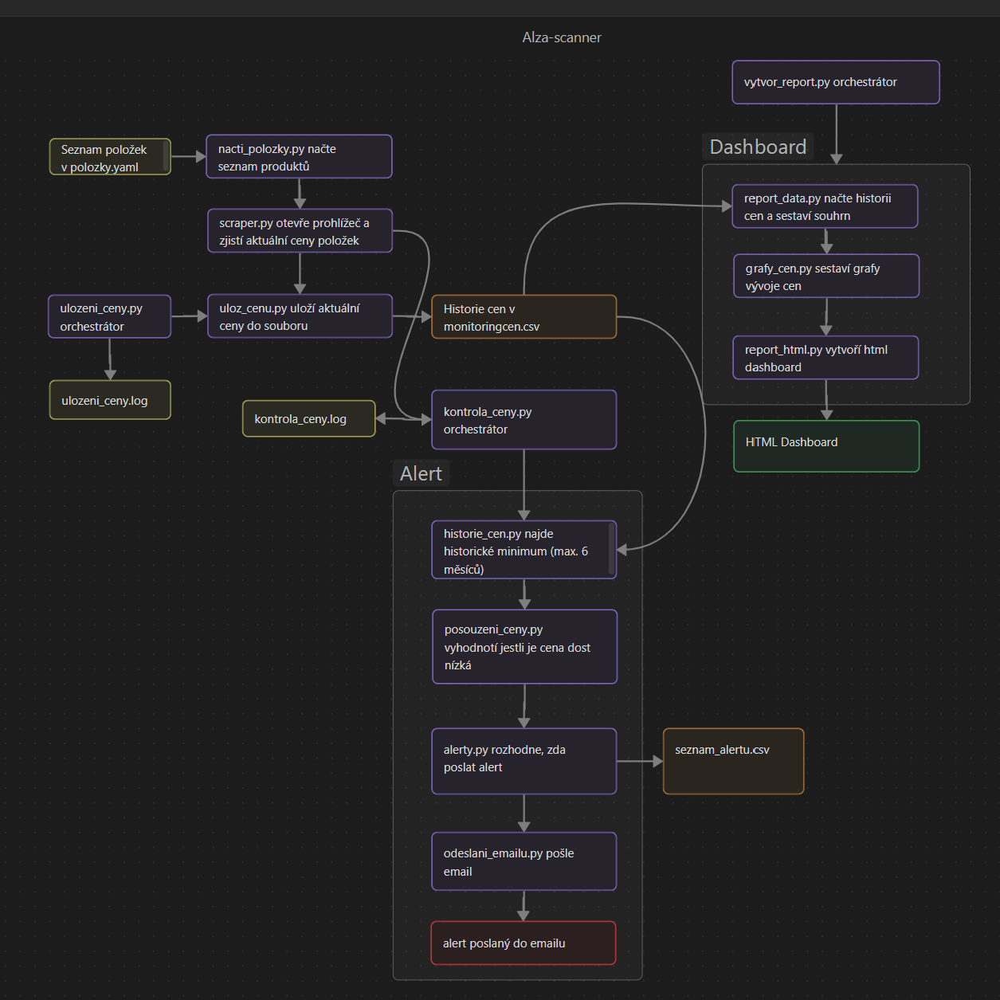

# Alza Scanner

> Toto je Windows verze projektu — běží lokálně a pravidelně ji spouští Windows Task Scheduler.
> Verze s Dockerem a CI/CD pipeline přes GitHub Actions: [alza-scanner-linux](https://github.com/numpe2-cloud/alza-scanner-linux)

Osobní nástroj pro sledování cen vybraných produktů na Alza.cz. Hlídá historické minimum a pošle e-mailový alert, když cena klesne pod obvyklou hranici.



## Motivace

Chtěl jsem vytvořit něco, co pro mě bude užitečné v praxi. Nejdřív jsem uvažoval nad scraperem obsahu Českého rozhlasu, ale postupně mi došlo, že bych ho stejně nevyužíval. Sledování vývoje cen u produktů, které si časem plánuji koupit, mi přišlo jako mnohem praktičtější nápad. Do projektu si teď můžu přidat jakýkoliv produkt a sledovat jeho cenu, dokud se nerozhodnu koupit.

Vím, že podobná řešení už existují a možná i lepší než to moje, ale bavilo mě zkusit si to postavit od nuly. Překvapilo mě, jak i na první pohled malý projekt je ve skutečnosti komplexní a kolik různých problémů se během vývoje objeví. Např. jsem musel vyzkoušet víc postupů, než se mi podařilo obejít zabezpečení stránek Alzy a spolehlivě načíst aktuální cenu.

## Tech stack

- **Python 3** — hlavní jazyk projektu
- **Playwright** — scraping cen z Alza.cz (headless=False kvůli obejití Cloudflare ochrany)
- **PyYAML** — konfigurace sledovaných produktů (`polozky.yaml`)
- **csv** / **datetime** — ukládání a práce s historií cen
- **smtplib** — odesílání e-mailových alertů
- **python-dotenv** — správa citlivých údajů (přihlašovací údaje k e-mailu) mimo kód
- **matplotlib** — grafy vývoje cen v dashboardu
- **pytest** — automatizované testy
- **flake8** — kontrola stylu kódu

## Jak to funguje

Projekt má tři hlavní části:

1. **Sběr a ukládání cen** — `scraper.py` načte aktuální ceny sledovaných produktů (definovaných v `polozky.yaml`), `ulozeni_ceny.py` je uloží do `monitoringcen.csv`
2. **Kontrola a alerty** — `kontrola_ceny.py` porovná aktuální cenu s historickým minimem za posledních 6 měsíců (`historie_cen.py`, `posouzeni_ceny.py`) a při výhodné ceně pošle e-mailový alert (`alerty.py`, `odeslani_emailu.py`), s deduplikací přes 30denní cooldown
3. **Dashboard** — `vytvor_report.py` sestaví HTML přehled s grafy vývoje cen (`report_data.py`, `grafy_cen.py`, `report_html.py`)

Podrobné schéma toků mezi jednotlivými soubory je výše.

### Spouštění

| Vstupní bod | Jak se spouští |
|---|---|
| `kontrola_ceny.py` | automaticky přes Windows Task Scheduler, každý den |
| `ulozeni_ceny.py` | automaticky přes Windows Task Scheduler, každých 14 dní |
| `vytvor_report.py` | ručně, když se chci podívat na dashboard: `python vytvor_report.py` |

### Struktura projektu

```
alza-scanner/
├── kontrola_ceny.py        # VSTUPNÍ BOD – porovná ceny s minimem, pošle alert
├── ulozeni_ceny.py         # VSTUPNÍ BOD – uloží aktuální ceny do historie
├── vytvor_report.py        # VSTUPNÍ BOD – vytvoří HTML dashboard s grafy
├── config/
│   └── polozky.yaml        # seznam sledovaných produktů (jediné místo, kde se mění)
├── src/
│   ├── scraper.py          # načte aktuální ceny z Alza.cz (Playwright)
│   ├── nacti_polozky.py    # načte produkty z polozky.yaml
│   ├── uloz_cenu.py        # připíše cenu do monitoringcen.csv
│   ├── historie_cen.py     # najde historické minimum za posledních 182 dní
│   ├── posouzeni_ceny.py   # rozhodne, jestli je cena výrazně pod minimem
│   ├── alerty.py           # hlídá 30denní pauzu mezi alerty na stejný produkt
│   ├── odeslani_emailu.py  # odešle e-mail přes Gmail (smtplib)
│   ├── report_data.py      # připraví data pro dashboard
│   ├── grafy_cen.py        # vykreslí grafy vývoje cen (matplotlib)
│   └── report_html.py      # sestaví HTML stránku dashboardu
├── test/
│   ├── test_posouzeni_ceny.py
│   └── test_najdi_minimum.py
├── requirements.txt        # Python knihovny
├── conftest.py             # prázdný, aby pytest našel moduly v src/
├── .flake8                 # pravidla kontroly stylu
├── .gitignore
└── schema.png              # diagram toku dat
```

## Předpoklady

- Windows s WSL (Ubuntu) — venv i Playwright běží uvnitř WSL
- Python 3.14

## Instalace a spuštění

1. Naklonuj repozitář:
   ```
   git clone https://github.com/numpe2-cloud/alza-scanner
   cd alza-scanner
   ```

2. Vytvoř a aktivuj virtuální prostředí:
   ```
   python -m venv .venv
   ```
   Aktivace:
   ```
   source .venv/bin/activate      # Linux/WSL
   ```

3. Nainstaluj závislosti:
   ```
   pip install -r requirements.txt
   playwright install
   ```

4. Nastav sledované produkty v `config/polozky.yaml` podle existujícího vzoru.

5. Vytvoř soubor `.env` v kořeni projektu s vlastními přihlašovacími údaji k e-mailu (viz sekce Proměnné prostředí níže).

6. Spusť ruční test:
   ```
   python ulozeni_ceny.py
   ```
   Zkontroluj, že se cena uložila do `data/monitoringcen.csv`, a pak:
   ```
   python kontrola_ceny.py
   ```
   Nakonec vytvoř dashboard:
   ```
   python vytvor_report.py
   ```
   Zkontroluj, že se dashboard vytvořil, a otevři `report.html` z kořene projektu v prohlížeči.

7. Pro pravidelné automatické spouštění (např. jednou denně) nastav podle svého prostředí Windows Task Scheduler nebo cron.

## Proměnné prostředí

Projekt potřebuje soubor `.env` v kořeni projektu (nikdy se necommituje do gitu — je v `.gitignore`) s těmito proměnnými:

```
odesilatel=tvuj_email@gmail.com
heslo=tvoje_app_password
prijemce=email_kam_chodi_alerty@example.com
```

**Poznámka:** `heslo` musí být Gmail App Password (vygenerovaný v nastavení Google účtu), ne běžné heslo k účtu — Gmail SMTP s normálním heslem odmítne přihlášení.

## Testování

Projekt má jednotkové testy (`pytest`) pro čisté funkce (`posouzeni_ceny()`, `najdi_minimum()`) a je průběžně kontrolovaný linterem `flake8`.

```
pytest
flake8 .
```

## Proč takhle

- **CSV místo databáze** — CSV jsem znal a na pár produktů s několika záznamy týdně úplně stačí. Soubor se dá otevřít v čemkoliv a nic dalšího se nemusí instalovat. Při velkém objemu dat by bylo CSV pomalé, tady to ale nehrozí.
- **Dlouhý formát `datum,nazev,cena`** — každé uložení ceny je nový řádek, takže přidání dalšího produktu nemění strukturu souboru. V širokém formátu (sloupec pro každý produkt) by každý nový produkt znamenal nový sloupec. Daní je, že soubor roste o řádek za každý produkt při každém uložení.
- **Playwright s `headless=False`** — Alza blokuje jednoduché stahování stránky (`requests`) i prohlížeč bez okna (Cloudflare ochrana). Funkční bylo až spuštění prohlížeče s oknem.
- **`polozky.yaml` jako jediné místo pravdy** — o tom, které produkty se sledují a zobrazují v dashboardu, rozhoduje jen tenhle soubor. Původně bral dashboard produkty z historie v CSV, takže v něm zůstával i produkt, který jsem už nesledoval. Teď stačí upravit `polozky.yaml` a historie v CSV zůstane zachovaná.
- **Windows Task Scheduler místo serveru** — pro dlouhodobé sledování cen by musel server běžet měsíce. Nedávalo mi smysl kvůli tomu nechávat zapnutý další počítač, když stejnou práci dělá plánovač úloh na počítači, který běží tak jako tak.

## Etická poznámka ke scrapingu

Před spuštěním jsem se přes sociální sítě zeptal na proveditelnost a etickou stránku scrapingu. Oficiální účet Alza.cz mi na dotaz ohledně osobního, nízkoobjemového monitoringu cen odpověděl, že v takhle malém rozsahu nemají námitky.

## Použití AI

Většinu projektu (scraper, ukládání a kontrola cen, alerty, testy) jsem psal sám s pomocí AI asistenta, který mě vedl a opravoval chyby, ale kód psal vždy já. Výjimkou je sekce dashboardu — `report_data.py`, `grafy_cen.py` a `report_html.py` — kterou navrhla a napsala přímo AI. Sestavování grafů a HTML reportu mě nebavilo, ale zároveň jsem chtěl mít v projektu hezký přehledový dashboard, takže jsem se rozhodl tuhle část nechat na AI.
